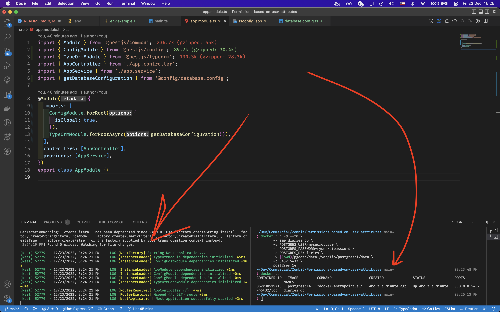

# Implementing Access Control in Nest.JS

- [About](#about)
- [Preparing](#setting-nestjs-database--typeorm)

## About
We will create a platform where the user can create an online diary - a tool to record their daily emotions and activities in a journal. 

And **the user can give access to other users** by level:
- read-only
- to edit
- deleting

## Setting NestJS, Database & TypeORM
before you need to install the global package nest and create a new project.

```bash
npm i -g @nestjs/cli
nest new websocket-module-communication
```
We got the following file structure:
```bash
permission-based-on-user-attributes/
├── node_modules/
├── src/
├── test/
├── .eslintrc.js
├── .gitignore
├── .prettierrc
├── nest-cli.json
├── package.json
├── package-lock.json
├── README.md
├── tsconfig.build.md
└── tsconfig.json
```

I will be using [TypeORM](https://typeorm.io/) and [Postgres](https://www.postgresql.org/).

```bash
npm install --save @nestjs/typeorm typeorm pg
```
To connect to the database we will be using environment variables.
A best practice is to [store configuration](https://12factor.net/config) variables in the environment.

A good approach for using this technique in Nest is to create a `ConfigModule` that exposes a `ConfigService` that loads the appropriate `.env` file. 
While you may choose to write such a module yourself, for convenience Nest provides the `@nestjs/config` package [out-of-the box](https://docs.nestjs.com/techniques/configuration#configuration).

```bash
npm i --save @nestjs/config
```
```bash
# .env
DATABASE_HOST="localhost"
DATABASE_PORT="5432"
POSTGRES_USER="mysecretuser"
POSTGRES_PASSWORD="mysecretpassword"
POSTGRES_DB="diaries"
```
Now, let's create a new file - `/src/conf/database.config.ts` and add the code below to it.
```typescript
// src/conf/database.config.ts
import { ConfigModule, ConfigService } from '@nestjs/config';
import { TypeOrmModuleAsyncOptions } from '@nestjs/typeorm';
import { join } from 'path';

export const getDatabaseConfiguration = (): TypeOrmModuleAsyncOptions => ({
  imports: [ConfigModule],
  inject: [ConfigService],

  useFactory: (configService: ConfigService) => ({
    type: 'postgres',
    host: configService.get<string>('DATABASE_HOST'),
    port: parseInt(configService.get<string>('DATABASE_PORT')),
    username: configService.get<string>('POSTGRES_USER'),
    password: configService.get<string>('POSTGRES_PASSWORD'),
    database: configService.get<string>('POSTGRES_DB'),
    entities: [join(__dirname, '..', '/**/*.entity{.ts,.js}')],
    synchronize: true,
  }),
});
```

The final result of a file structure should look like this:
```bash
permission-based-on-user-attributes/
├── node_modules/
├── src/
│  ├── conf/ 
│  │ │   └─ database.config.ts # configuration to connect to DB.
│  │ └── layout.hbs
│  ├── app.controller.ts
│  ├── app.module.ts
│  ├── app.service.ts
│  └── main.ts
├── test/
├── .env
├── .env.example
├── .eslintrc.js
├── .gitignore
├── .prettierrc
├── nest-cli.json
├── package.json
├── package-lock.json
├── README.md
├── tsconfig.build.md
└── tsconfig.json
```

I like to use an alias path instead of relative.
Update `tsconfig.json` file
```json
// tsconfig.json
      ... ...

  "paths": {
      "@config/*": [
        "./src/conf/*"
      ]
    }

      ... ...

```

finally, update our `app.module.ts`
```ts
import { Module } from '@nestjs/common';
import { ConfigModule } from '@nestjs/config';
import { TypeOrmModule } from '@nestjs/typeorm';
import { AppController } from './app.controller';
import { AppService } from './app.service';
import { getDatabaseConfiguration } from '@config/database.config';

@Module({
  imports: [
    ConfigModule.forRoot({
      isGlobal: true,
    }),
    TypeOrmModule.forRootAsync(getDatabaseConfiguration()),
  ],
  controllers: [AppController],
  providers: [AppService],
})
export class AppModule {}
```
Before you start the app. 

The database must be started.
I will use the docker container.

```bash
$ docker run -d --rm \
	--name diaries_db \
	-e POSTGRES_USER=mysecretuser \
	-e POSTGRES_PASSWORD=mysecretpassword \
	-e POSTGRES_DB=diaries \
	-v $(pwd)/pgdata/data:/var/lib/postgresql/data \
	-p 5432:5432 \
	postgres:14
```

After running the app, you should see this:

## create users and diaries modules
First, we create a module, controller and service for the user.
```bash
nest generate module user
nest generate service user
nest generate controller user
```
Then, the same for the diary

```bash
nest generate module diary
nest generate service diary
nest generate controller diary
```
```bash
# for validation
 npm i --save class-validator class-transformer
```
and  create two entities
```bash
# user
touch ./src/entities/User.entity.ts  
# diary
touch ./src/entities/Diary.entity.ts 
```

update entities
```ts
// src/entities/User.entity.ts
import {
  Column,
  CreateDateColumn,
  Entity,
  PrimaryGeneratedColumn,
} from 'typeorm';

@Entity({ name: 'users' })
export class UserEntity {
  @PrimaryGeneratedColumn('uuid')
  id: string;

  @Column('varchar')
  username: string;

  @Column('varchar')
  password: string;

  @CreateDateColumn()
  createdAt: Date;
}
```

```ts
// src/entities/Diary.entity.ts
import {
  Column,
  CreateDateColumn,
  Entity,
  ManyToOne,
  PrimaryGeneratedColumn,
} from 'typeorm';
import { UserEntity } from './User.entity';

@Entity({ name: 'diaries' })
export class DiaryEntity {
  @PrimaryGeneratedColumn('uuid')
  id: string;

  @Column('text')
  text: string;

  @CreateDateColumn()
  createdAt: Date;

  @ManyToOne(() => UserEntity)
  user: UserEntity;
}
```

update service and controller
```ts
// src/user/user.service.ts
import { UserEntity } from '@entities/User.entity';
import { Injectable, UnprocessableEntityException } from '@nestjs/common';
import { InjectRepository } from '@nestjs/typeorm';
import { Repository } from 'typeorm';
import { CreateUserDto } from './dto/create-user.dto';

@Injectable()
export class UserService {
  constructor(
    @InjectRepository(UserEntity)
    private readonly userRepository: Repository<UserEntity>,
  ) {}
  async create(createUserDto: CreateUserDto) {
    try {
      const { username, password } = createUserDto;
      const user = this.userRepository.create();
      return await this.userRepository.save({ ...user, username, password });
    } catch (error) {
      throw new UnprocessableEntityException(error);
    }
  }

  async all() {
    try {
      return await this.userRepository.find();
    } catch (error) {
      throw new UnprocessableEntityException(error);
    }
  }
}
```
> WARNING
Of course in a real application, you wouldn't store a password in plain text. You'd instead use a library like bcrypt, with a salted one-way hash algorithm. With that approach, you'd only store hashed passwords, and then compare the stored password to a hashed version of the incoming password, thus never storing or exposing user passwords in plain text. To keep our sample app simple, we violate that absolute mandate and use plain text. **Don't do this in your real app!**
```ts
// src/user/user.controller.ts
import {
  Body,
  Controller,
  Get,
  InternalServerErrorException,
  Post,
  UsePipes,
  ValidationPipe,
} from '@nestjs/common';
import { CreateUserDto } from './dto/create-user.dto';
import { UserService } from './user.service';

@Controller('user')
export class UserController {
  constructor(private readonly userService: UserService) {}
  @Post()
  @UsePipes(new ValidationPipe({ transform: true }))
  async createUser(@Body() createUserDto: CreateUserDto) {
    try {
      return await this.userService.create(createUserDto);
    } catch (error) {
      throw new InternalServerErrorException(error);
    }
  }

  @Get()
  @UsePipes(new ValidationPipe({ transform: true }))
  async getAllUsers() {
    try {
      return await this.userService.all();
    } catch (error) {
      throw new InternalServerErrorException(error);
    }
  }
}

Perfect! Now, we need protect our routes.

```
```bash
$ npm install --save @nestjs/jwt
$ npm install --save @nestjs/passport passport passport-jwt
$ npm install --save-dev @types/passport-jwt


```

## JWT Strategy

## Permission Access Control


```typescript
1. Add new column to table users:
    permissions: [POST_READ, POST_WRITE, PASS_READ, PASS_WRITE]
2. Create enum with roles:
    ${ENTITY_NAME}_READ, ${ENTITY_NAME}_WRITE, ${ENTITY_NAME}_EDIT, ${ENTITY_NAME}_DELETE
3. Create new Guard to check roles
4. Add permissions to JWT token to allow UI to read this (permissions > 50, create new endpoint like: /permissions => ['', '', ''])
​
​
​
export const TargetPermission = (targetPermission: UsersPermissionsEnum[]) => SetMetadata('targetPermission', targetPermission);
​
​
constructor(private readonly _reflector: Reflector, private readonly _amqpConnection: AmqpConnection) {}
​
  canActivate(context: ExecutionContext): Observable<boolean> {
    const req = context.switchToHttp().getRequest();
    const token = req.headers['token'];
    const {permissions} = jwt.decoded(token);
    if (!permissions.length) return false;
    
    const targetPermission = this._reflector.getAllAndOverride<UsersPermissionsEnum>('targetPermission', [
      context.getHandler(),
      context.getClass(),
    ]);
​
    return permissions.includes(targetPermission) || false;
  }
​
​
@UseGuards(PermissionsGuard)
​
@TargetPermission(UsersPermissionsEnum.PACIENTS_READ)

```

https://medium.com/teamzerolabs/rbac-vs-abac-in-node-js-backend-321a426faae2